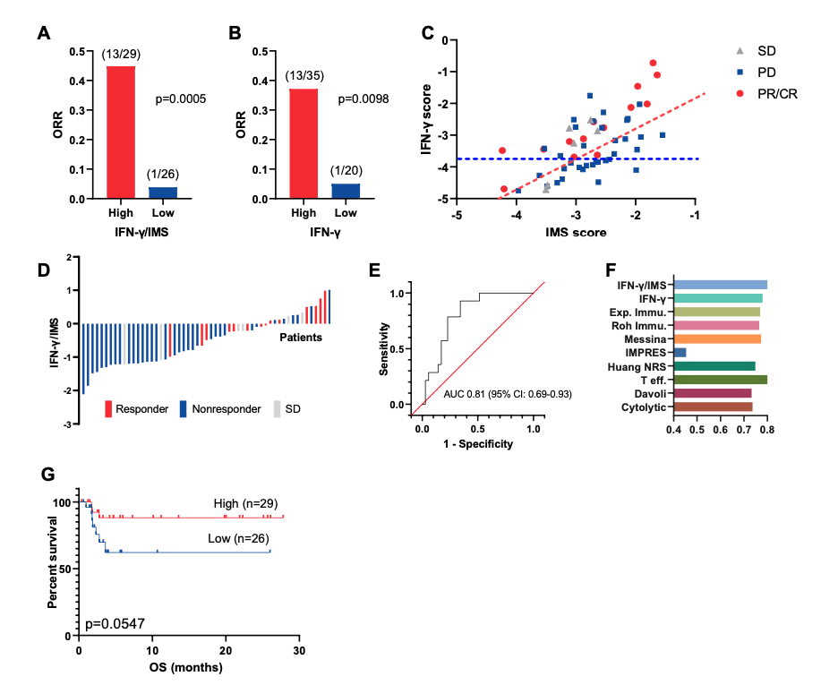

# Ratio of the interferon-γ signature to the immunosuppression signature predicts anti-PD-1 therapy response in melanoma

## Abstract

Immune checkpoint inhibitor (ICI) treatments produce clinical benefit in many patients. However, better pretreatment predictive biomarkers for ICI are still needed to help match individual patients to the treatment most likely to be of benefit. Existing gene expression profiling (GEP)-based biomarkers for ICI are primarily focused on measuring a T cell-inflamed tumour microenvironment that contributes positively to the response to ICI. Here, we identified an immunosuppression signature (IMS) through analysing RNA sequencing data from a combined discovery cohort (n = 120) consisting of three publicly available melanoma datasets. Using the ratio of an established IFN-γ signature and IMS led to consistently better prediction of the ICI therapy outcome compared to a collection of nine published GEP signatures from the literature on a newly generated internal validation cohort (n = 55) and three published datasets of metastatic melanoma treated with anti- PD-1 (n = 54) and anti-CTLA-4 (n = 42) as well as in patients with gastric cancer treated with anti-PD-1 (n = 45), demonstrating the potential utility of IMS as a predictive/prognostic biomarker that complements existing GEP signatures for immunotherapy.


## Result


Ratio of IFN-γ signature and IMS predicts response to ICI immunotherapy on the PUCH cohort.A, The ORR of patients from IFN-γ/IMS-high vs IFN-γ/IMS-low and B IFN-γ-high vs IFN-γ-low on the PUCH cohort. The cutoff points were decided by the Youden index for IFN-γ/IMS and IFN-γ scores, respectively. C, IFN-γ signature and IMS scores of individual patients in the PUCH cohort. The red and blue dashed lines indicate the cutoff points for IFN-γ/IMS ratio and IFN-γ, respectively. D, Waterfall plots of IFN-γ/IMS versus patients with different clinical responses to anti-PD-1 therapy in the PUCH cohort. E, ROC curve of the sensitivity versus 1-specificity of the predictive performance of IFN-γ/IMS. Patients with SD were not included in AUC calculation. F, Comparison of the AUC of IFN-γ/IMS with nine GEP signatures in predicting response to ICI. G, Kaplan-Meier plots of OS segregated by IFN-γ/IMS ratio with cutoff points selected according to the Youden index.
## Dataset

|   Dataset  |     Expression data     |      Clinical data      |         Survival data        |
|:----------:|:-----------------------:|:-----------------------:|:----------------------------:|
|   Riaz17   | mel_bms038_exp_data.csv | mel_bms038_cli_data.csv | mel_bms038_survival_data.csv |
|   Gide19   | mel_gide19_exp_data.csv | mel_gide19_cli_data.csv | mel_gide19_survival_data.csv |
|   Hugo16   | mel_hugo16_exp_data.csv | mel_hugo16_cli_data.csv | mel_hugo16_survival_data.csv |
| VanAllen15 |   mel_van_exp_data.csv  |   mel_van_cli_data.csv  |   mel_van_survival_data.csv  |
|    Liu19   |  mel_liu19_exp_data.csv |  mel_liu19_cli_data.csv |   mel_liu_survival_data.csv  |
|    PUCH    | mel_puch_exp_data.csv   |  mel_puch_cli_data.csv  |    |
|    Kim18   | gas_korean_exp_data.csv | gas_korean_cli_data.csv |                              |

## Repository Structure

    ├── data
    │   ├── gas_korean_cli_data.csv
    │   ├── gas_korean_exp_data.csv
    │   ├── mel_bms038_cli_data.csv
    │   ├── mel_bms038_exp_data.csv
    │   ├── mel_bms038_survival_data.csv
    │   ├── mel_gide19_cli_data.csv
    │   ├── mel_gide19_exp_data.csv
    │   ├── mel_gide19_survival_data.csv
    │   ├── mel_hugo16_cli_data.csv
    │   ├── mel_hugo16_exp_data.csv
    │   ├── mel_hugo16_survival_data.csv
    │   ├── mel_liu19_cli_data.csv
    │   ├── mel_liu19_exp_data.csv
    │   ├── mel_liu_survival_data.csv
    │   ├── mel_puch_cli_data.csv
    │   ├── mel_puch_exp_data.csv
    │   ├── mel_van_cli_data.csv
    │   ├── mel_van_exp_data.csv
    │   ├── mel_van_survival_data.csv
    │   └── NanoString_gene_list.txt
    ├── README.md
    ├── requirements.txt
    └── src
        ├── calculate_performance.py
        ├── calculate_ratio_score.py
        ├── load_data.py
        ├── main.py
        └── survival.py

- Language Version Python 3.7.3.
- requirements.txt: list of version of packages used in this software.
- data: All the expression data and clinical data of the datasets
- NanoString_gene_list.txt: List of cancer immune-related genes curated in Nanostring’s IO 360 panel.
- calculate_ratio_score.py: Python code for identification of IMS genes and calculation of the ratio of IFN-γ signature score and IMS score.
- calculate_performance.py: Python code for calculation of the area under the operational curve (AUC) score.
- main.py: Python code for calculation of AUC of IFN-γ/IMS ratio for all datasets
- survival.py: Python code for generation of survival curve plot of each dataset.


## Usage
Install packages
```bash
pip install -r requirements.txt
```
Identification of the IMS genes from the combined discovery dataset (Riaz17, Gide19, Hugo16)
```bash
cd ./src
```
```bash
python calculate_ratio_score.py
# output: IMS genes list 
```
Calculate AUC of IFN-γ/IMS ratio score for all datasets 
```bash
python main.py
# output: auc of IFN-γ/IMS ratio score for all datasets
```
Draw survival curve
```bash
python survival.py
# output: ./result/{dataset}_survival_OS.pdf
```

## Citation
If any part of this code is used, please give appropriate citation to our paper.

  *Ratio of the interferon-γ signature to the immunosuppression signature predicts anti-PD-1 therapy response in melanoma*